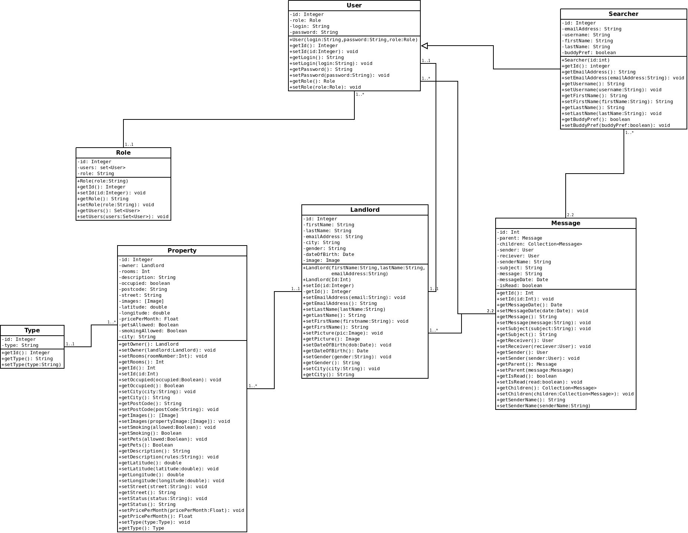

Diagrams
=============

Domain Class Diagram
-------------

This diagram shows the scope of the system, the domain part of the system.

Whole System Class Diagram
-------------

This diagram shows the entire system, with all the layers inclusive, the domain, security and controllers are all present in this diagram.

Component Diagram
-------------

This diagram models the high-level software components, and also shows the interfaces to those components.

Message Navigational Model
-------------

This model, shows how the message controller works.

Authentication Navigational Model
-------------

This model, shows how the authentication controller works.

Registation Navigational Model
-------------

This model, shows how the Registation controller works.

Database Schema
-------------

CREATE TABLE IF NOT EXISTS `admin` (
  `user_id` int(11) NOT NULL,
  `confirm_email` varchar(255) DEFAULT NULL,
  `confirm_password` varchar(255) DEFAULT NULL,
  `email` varchar(255) DEFAULT NULL,
  `first_name` varchar(255) DEFAULT NULL,
  `last_name` varchar(255) DEFAULT NULL,
  `password` varchar(255) DEFAULT NULL,
  `user_name` varchar(255) DEFAULT NULL
) ENGINE=InnoDB DEFAULT CHARSET=latin1;

CREATE TABLE IF NOT EXISTS `landlord` (
  `id` int(11) NOT NULL,
  `email_address` varchar(255) DEFAULT NULL,
  `first_name` varchar(255) DEFAULT NULL,
  `last_name` varchar(255) DEFAULT NULL
) ENGINE=InnoDB DEFAULT CHARSET=latin1;

CREATE TABLE IF NOT EXISTS `messages` (
  `id` int(11) NOT NULL,
  `is_read` bit(1) DEFAULT NULL,
  `message` varchar(512) DEFAULT NULL,
  `message_date` datetime DEFAULT NULL,
  `sender_name` varchar(255) DEFAULT NULL,
  `subject` varchar(255) DEFAULT NULL,
  `parent_id` int(11) DEFAULT NULL,
  `receiver_id` int(11) DEFAULT NULL,
  `sender_id` int(11) DEFAULT NULL
) ENGINE=InnoDB AUTO_INCREMENT=3 DEFAULT CHARSET=latin1;

INSERT INTO `messages` (`id`, `is_read`, `message`, `message_date`, `sender_name`, `subject`, `parent_id`, `receiver_id`, `sender_id`) VALUES
(1, b'0', 'hello', '2016-03-04 01:55:01', 'admin', 'test', NULL, 1, 1),
(2, b'0', 'hello1', '2016-03-04 01:55:02', 'alice', 'test1', 1, 1, 2);

CREATE TABLE IF NOT EXISTS `property` (
  `id` int(11) NOT NULL,
  `city` varchar(255) DEFAULT NULL,
  `number` varchar(255) DEFAULT NULL,
  `postcode` varchar(255) DEFAULT NULL,
  `rooms` int(11) DEFAULT NULL,
  `street` varchar(255) DEFAULT NULL,
  `landlord` int(11) DEFAULT NULL,
  `type` int(11) DEFAULT NULL
) ENGINE=InnoDB DEFAULT CHARSET=latin1;

CREATE TABLE IF NOT EXISTS `role` (
  `id` int(11) NOT NULL,
  `role` varchar(255) DEFAULT NULL
) ENGINE=InnoDB DEFAULT CHARSET=latin1;

INSERT INTO `role` (`id`, `role`) VALUES
(1, 'ADMINISTRATOR'),
(2, 'LANDLORD'),
(3, 'SEARCHER');

CREATE TABLE IF NOT EXISTS `searcher` (
  `id` int(11) NOT NULL,
  `buddy_pref` bit(1) NOT NULL,
  `email_address` varchar(255) DEFAULT NULL,
  `first_name` varchar(255) DEFAULT NULL,
  `last_name` varchar(255) DEFAULT NULL
) ENGINE=InnoDB DEFAULT CHARSET=latin1;

CREATE TABLE IF NOT EXISTS `type` (
  `id` int(11) NOT NULL,
  `type` varchar(255) DEFAULT NULL
) ENGINE=InnoDB AUTO_INCREMENT=3 DEFAULT CHARSET=latin1;

INSERT INTO `type` (`id`, `type`) VALUES
(1, 'Flat'),
(2, 'House');

CREATE TABLE IF NOT EXISTS `user` (
  `id` int(11) NOT NULL,
  `login` varchar(255) DEFAULT NULL,
  `password` varchar(255) DEFAULT NULL,
  `role` int(11) DEFAULT NULL
) ENGINE=InnoDB AUTO_INCREMENT=3 DEFAULT CHARSET=latin1;

INSERT INTO `user` (`id`, `login`, `password`, `role`) VALUES
(1, 'admin', '$2a$10$LOeVSv0vAWv1QTFggqCZpun5805EmVZcA3DdZ1AlseP7B4qRwLTFG', 1),
(2, 'alice', '$2a$10$It4Nwnc9qQ2n.zQ9erfOe.QBcsN3XQnOchHqykkUKsKc5DdXhc0Nm', 3);

ALTER TABLE `admin`
  ADD PRIMARY KEY (`user_id`);

ALTER TABLE `landlord`
  ADD PRIMARY KEY (`id`);

ALTER TABLE `messages`
  ADD PRIMARY KEY (`id`), ADD KEY `FK_4v30oo6svjuouqfbn8dr4xlgq` (`parent_id`), ADD KEY `FK_n6etueqjx4sscap8ji01eq224` (`receiver_id`), ADD KEY `FK_2tgrsfo79pwvrwk6lbdy32701` (`sender_id`);

ALTER TABLE `property`
  ADD PRIMARY KEY (`id`), ADD KEY `FK_53g93c5tc7op77y6pv80xptry` (`landlord`), ADD KEY `FK_6pn7r25h3hawss06awckwrm05` (`type`);

ALTER TABLE `role`
  ADD PRIMARY KEY (`id`);

ALTER TABLE `searcher`
  ADD PRIMARY KEY (`id`);

ALTER TABLE `type`
  ADD PRIMARY KEY (`id`);

ALTER TABLE `user`
  ADD PRIMARY KEY (`id`), ADD KEY `FK_dl7g53f7lpmorjc24kx74apx8` (`role`);

ALTER TABLE `admin`
  MODIFY `user_id` int(11) NOT NULL AUTO_INCREMENT;
ALTER TABLE `messages`
  MODIFY `id` int(11) NOT NULL AUTO_INCREMENT,AUTO_INCREMENT=3;
ALTER TABLE `property`
  MODIFY `id` int(11) NOT NULL AUTO_INCREMENT;
ALTER TABLE `type`
  MODIFY `id` int(11) NOT NULL AUTO_INCREMENT,AUTO_INCREMENT=3;
ALTER TABLE `user`
  MODIFY `id` int(11) NOT NULL AUTO_INCREMENT,AUTO_INCREMENT=3;

ALTER TABLE `messages`
ADD CONSTRAINT `FK_2tgrsfo79pwvrwk6lbdy32701` FOREIGN KEY (`sender_id`) REFERENCES `user` (`id`),
ADD CONSTRAINT `FK_4v30oo6svjuouqfbn8dr4xlgq` FOREIGN KEY (`parent_id`) REFERENCES `messages` (`id`),
ADD CONSTRAINT `FK_n6etueqjx4sscap8ji01eq224` FOREIGN KEY (`receiver_id`) REFERENCES `user` (`id`);

ALTER TABLE `property`
ADD CONSTRAINT `FK_53g93c5tc7op77y6pv80xptry` FOREIGN KEY (`landlord`) REFERENCES `landlord` (`id`),
ADD CONSTRAINT `FK_6pn7r25h3hawss06awckwrm05` FOREIGN KEY (`type`) REFERENCES `type` (`id`);

ALTER TABLE `user`
ADD CONSTRAINT `FK_dl7g53f7lpmorjc24kx74apx8` FOREIGN KEY (`role`) REFERENCES `role` (`id`);

We have used MySQL to save data, above is the database schema. We have used Hibernate for the persistence layer making use of object relational mapping to easily query databases using SQL and set up the structure. 
