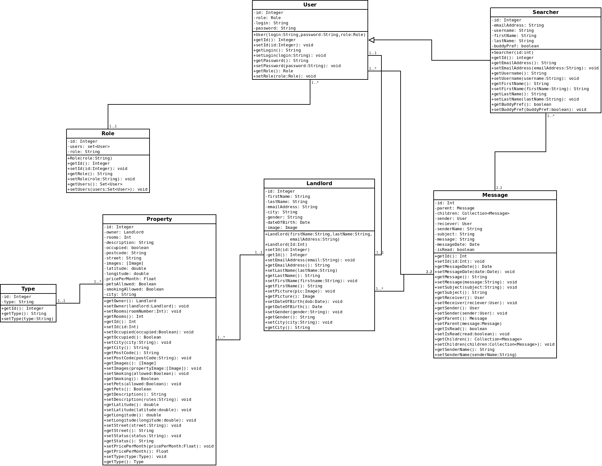
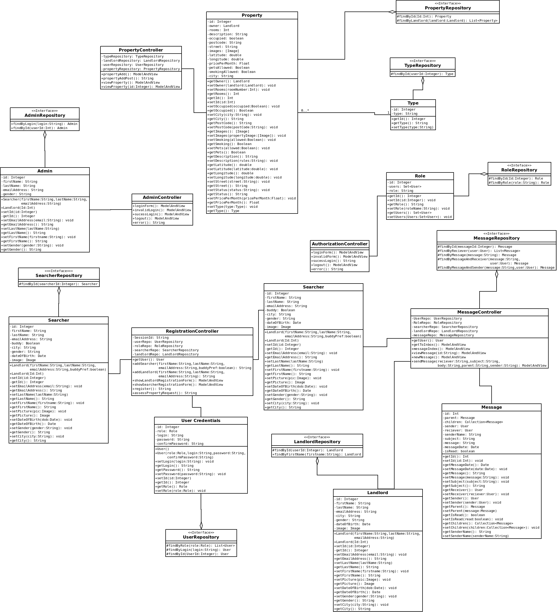
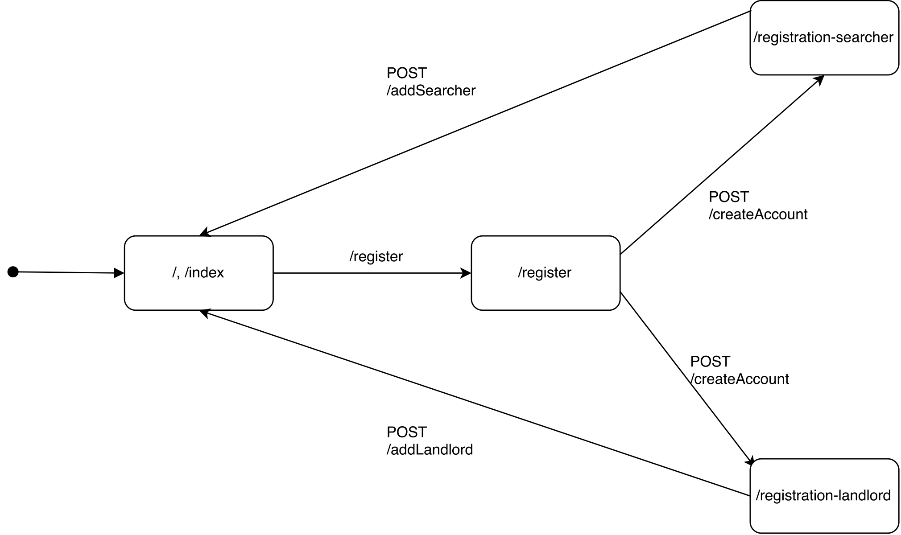

Diagrams
=============

Domain Class Diagram
-------------

This diagram shows the scope of the system, the domain part of the system.

Whole System Class Diagram
-------------

This diagram shows the entire system, with all the layers inclusive, the domain, security and controllers are all present in this diagram.

Component Diagram
-------------

This diagram models the high-level software components, and also shows the interfaces to those components.

Message Nav Model
-------------

This model, shows how the message controller works.

Authentication Nav Model
-------------

This model, shows how the authentication controller works.

Registation Nav Model
-------------

This model, shows how the Registation controller works.
