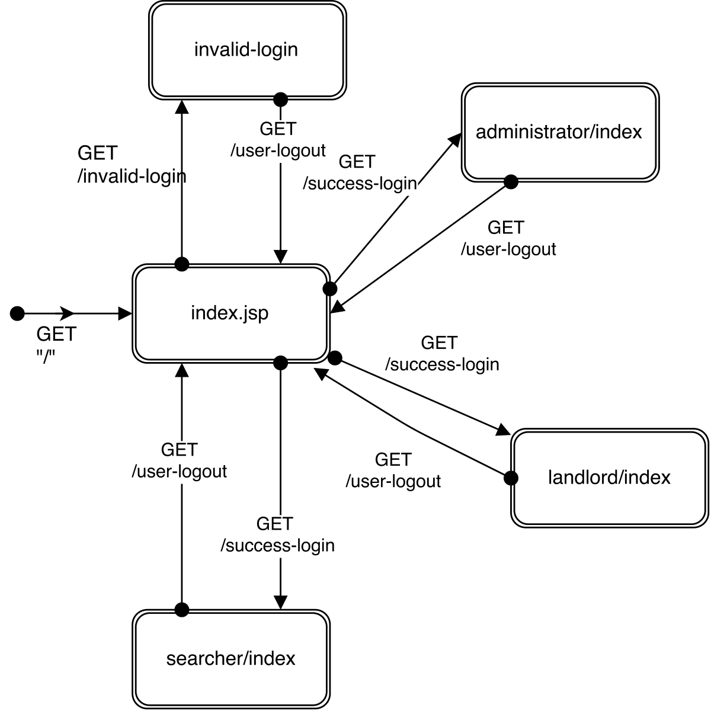

#Design Documents

##Use Case Diagram

A use case diagram can be summarised in four points:

The boundary, which defines the system of interest in relation to the world around it.
The actors, usually individuals involved with the system defined according to their roles.
The use cases, which are the specific roles played by the actors within and around the system.
The relationships between and among the actors and the use cases.

##Component Diagram

Shows all the components in the MVC architecture.

##Spring MVC Basic Architecture

The Spring MVC framework which uses the model, view and controller design pattern also comes with a lot of added functionality such as the Spring Security package; 
this can be utilised for user password encryption (bcrypt).
Above is a graphical representation of the design pattern which the Spring MVC framework utilises. Below is a step by step process of how the framework handles HTTP requests.

1) The Dispatcher object receives a HTTP request

2) Request pattern matching is delegated to the HandlerMapping object which returns a controller name and method to execute

3) The Dispatcher then invokes the controller method if it exists or throws an appropriate error message if needed.

4) On invocation the controller will gather necessary data in order to return data to Dispatcher this is in the form of Models and Views.

5) The dispatcher receives all required information from the controller which is needed to display the response to the user

6) The View is then processed along with Model data which forms the end user response

##Domain Class Diagram

This diagram shows the scope of the system, the domain part of the system. The User object is created when a user creates a new account 
it holds your username, password, and role. Landlord and Searcher object are to hold personal information such as name, email, this object 
is created within the web app when the user has created a user object then it would create either a searcher or landlord object based on 
the user role and take them to the appropriate screen. 

##Message Navigational Model

##Authentication Navigational Model

##Registation Navigational Model

These navigational models show how the user interacts with the system

##Database Schema

This schema shows all of the tables in the database, their contents and how they interact with one another. 

This class diagram shows the entire project in UML notation 

